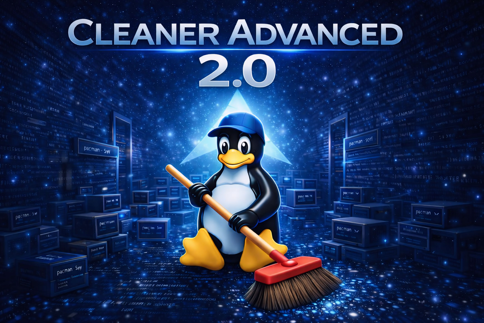
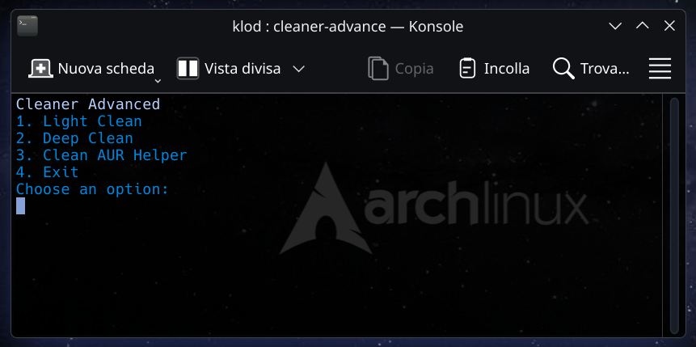
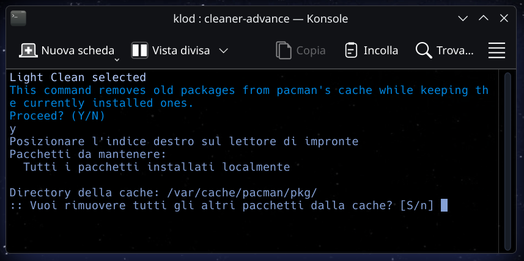
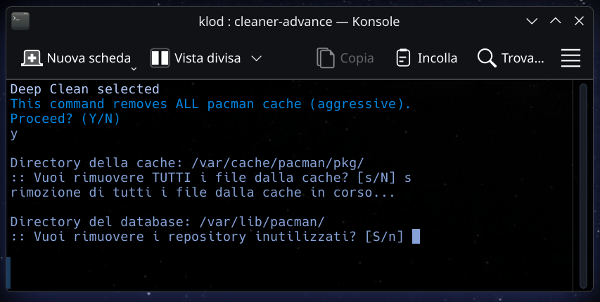
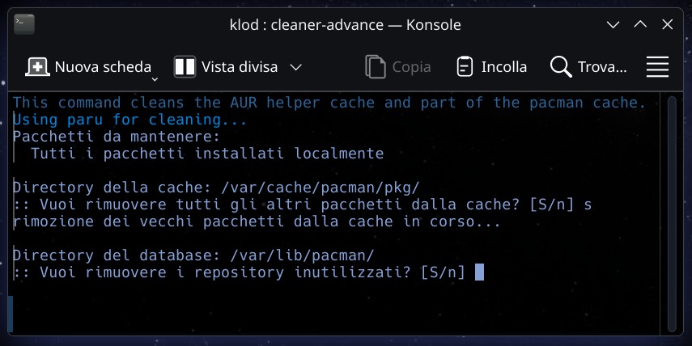

# English

<p align="center">
  
</p>

<h1 align="center">Cleaner Advanced</h1>

<p align="center">
A simple Arch Linux maintenance script written in Bash.
</p>

<p align="center">
  <a href="https://aur.archlinux.org/packages/cleaner-advanced">
    
  </a>
  <a href="LICENSE">
    
  </a>
  
</p>

---

Cleaner Advanced is a lightweight system maintenance script for Arch Linux users, written in Bash.

It was developed as a personal experimental project to automate common maintenance tasks while keeping full transparency over the executed operations.
## Features

- Cleans pacman cache
- Removes orphaned packages
- Cleans system journal
- Cleans temporary files
- Cleans AUR Helper cache
- Removes orphaned configuration files

---

## Screenshots

<p align="center">
  
  
</p>

<p align="center">
  
  
</p>

---

## Usage (recommended method)

To ensure maximum transparency, the recommended way to use Cleaner Advanced is to clone the repository and inspect the script before execution.

```bash
git clone https://github.com/KlodCripta/Cleaner-Advanced.git 
cd Cleaner-Advanced 
chmod +x cleaner-advanced.sh 
./cleaner-advanced.sh
```

This approach allows the user to fully review the code before running it, in line with Arch Linux and free software best practices.

## License

This project is licensed under the MIT License - see the LICENSE file for details.

## Author

Developed by Klod Cripta.

Contributions, issues reports and suggestions are welcome.

## You can contact Klod Cripta via email (KlodCripta@linux.it)

---------------------------------------------------------------------------------------------------------

# Italiano

<p align="center">
  
</p>

<h1 align="center">Cleaner Advanced</h1>

<p align="center">
Script di manutenzione del sistema Arch Linux scritto in Bash
</p>

<p align="center">
  <a href="https://aur.archlinux.org/packages/cleaner-advanced">
    
  </a>
  <a href="LICENSE">
    
  </a>
  
</p>

---

Cleaner Advanced è uno script di manutenzione per Arch Linux e derivate, sviluppato in Bash.

È nato come progetto personale sperimentale con l’obiettivo di automatizzare alcune operazioni comuni di manutenzione mantenendo la massima trasparenza sul codice eseguito.

## Caratteristiche

- Pulisce la cache di pacman
- Rimuove i pacchetti orfani
- Pulisce il giornale di sistema
- Pulisce i file temporanei
- Pulisce la cache degli AUR Helper
- Rimuove i file di configurazione orfani

---

## Screenshots

<p align="center">
  
  
</p>

<p align="center">
  
  
</p>

---

## Utilizzo (metodo consigliato)

Per garantire la massima trasparenza, il metodo consigliato consiste nel clonare il repository e ispezionare lo script prima dell’esecuzione.

```bash
git clone https://github.com/KlodCripta/Cleaner-Advanced.git 
cd Cleaner-Advanced 
chmod +x cleaner-advanced.sh 
./cleaner-advanced.sh
```

Questo approccio consente all’utente di verificare completamente il codice prima dell’esecuzione, in linea con la filosofia di Arch Linux e del software libero.

## Licenza

Questo progetto è concesso in licenza con la licenza MIT: vedere il file LICENSE per i dettagli.

## Autore

Sviluppato da Klod Cripta.

Contributi, segnalazioni e suggerimenti sono benvenuti.

## Puoi contattare Klod Cripta tramite email (KlodCripta@linux.it)
