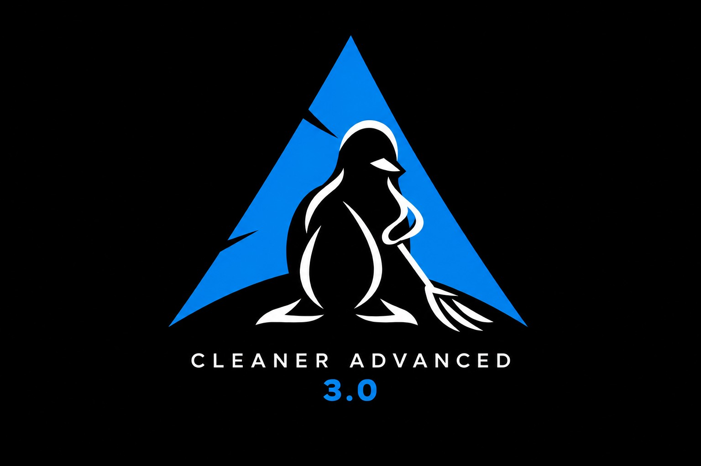
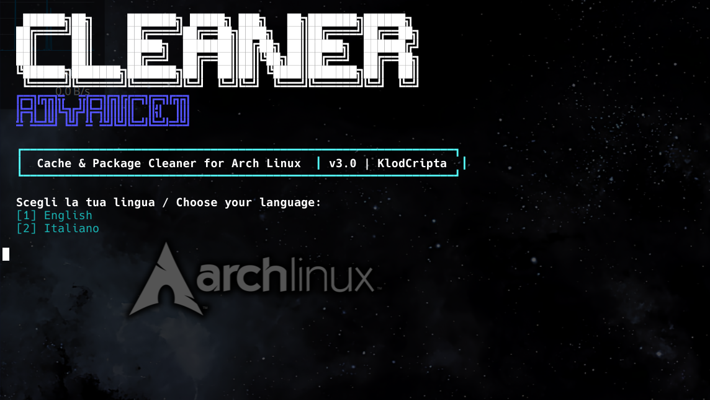
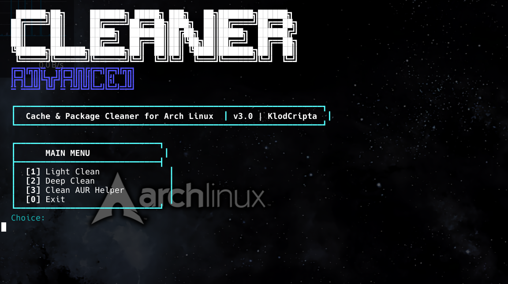
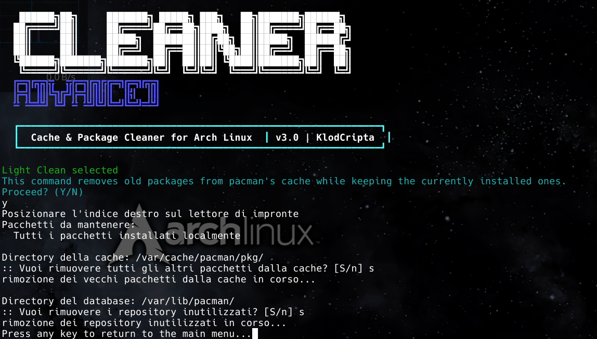
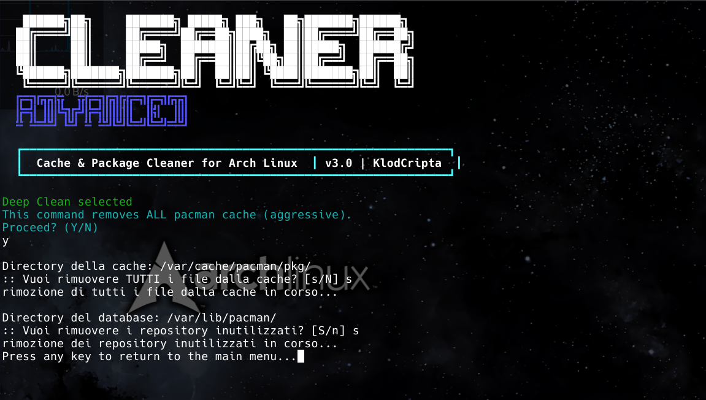
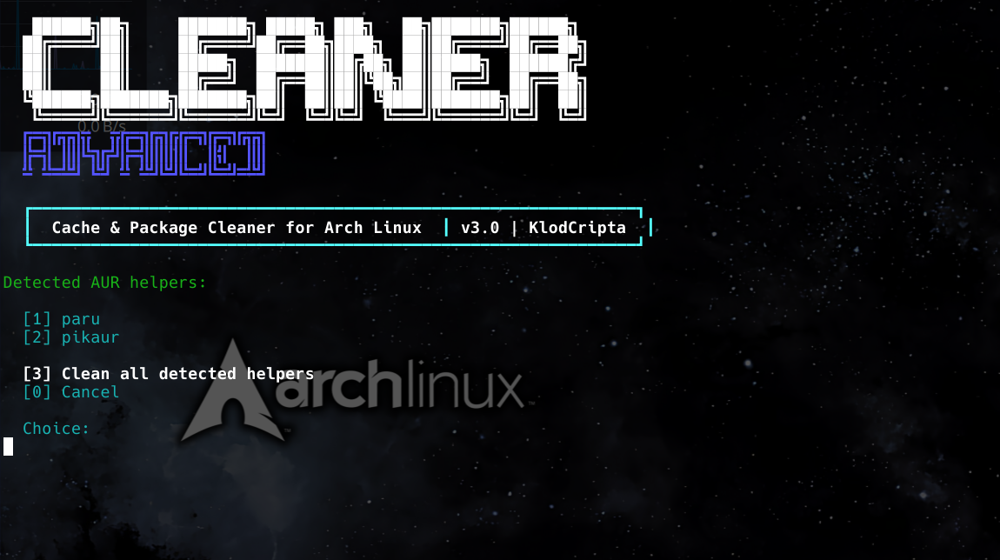
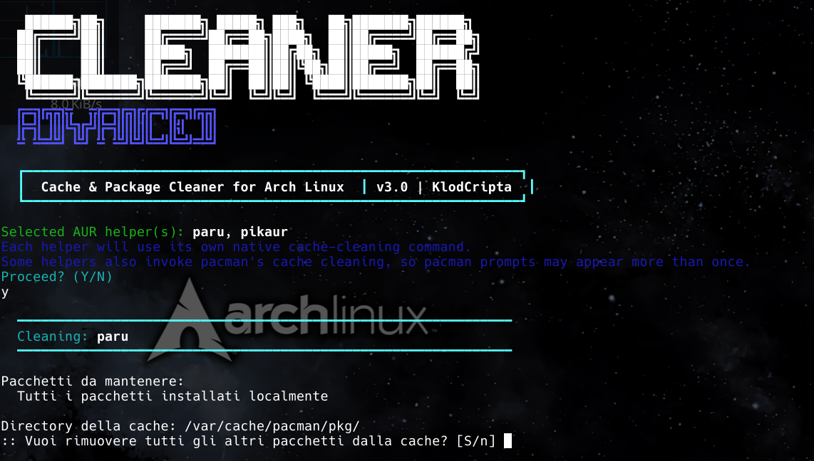
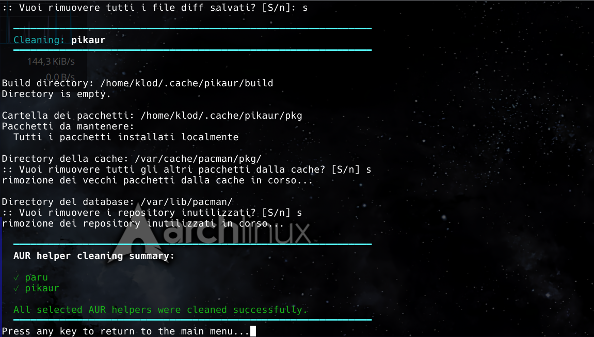
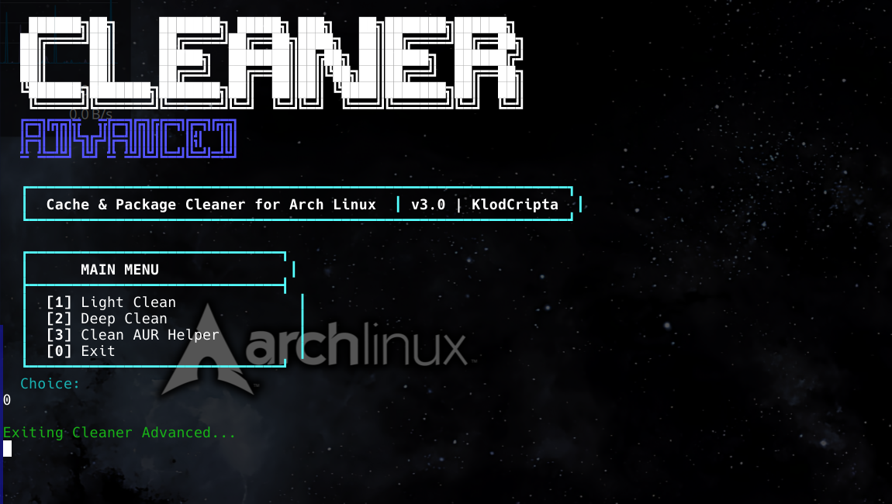

# Cleaner Advanced 3.0

[English](#english) · [Italiano](#italiano)


[](LICENSE)


## English

<p align="center">
  
</p>

Cleaner Advanced is a small Bash script for cleaning package caches on Arch Linux and its derivatives. It brings a few commands into one terminal menu, with an English or Italian interface.

Version 3.0 adds support for multiple AUR helpers. If you have more than one installed, you can choose which one to use or run them all in sequence.

### What it does

- **Light Clean:** runs `sudo pacman -Sc`. With pacman's default settings, it removes cached packages that are no longer installed and keeps the installed versions.
- **Deep Clean:** runs `sudo pacman -Scc` to empty the package cache.
- **Clean AUR Helper:** detects supported helpers and runs their cache-cleaning commands.
- Before cleaning, it also removes temporary `download-*` directories directly inside `/var/cache/pacman/pkg`.

It does not remove orphaned packages, clean the system journal or delete personal files. Pacman may also ask to remove unused repository databases.

### AUR helpers

| Helper | Command |
| --- | --- |
| paru | `paru -Sc` |
| yay | `yay -Sc` |
| pikaur | `pikaur -Sc` |
| aura (4.x) | `aura -Cc 1` |
| trizen | `trizen -Sc` |
| pakku | `pakku -Sc` |

With one helper installed, Cleaner asks for confirmation and proceeds. With more than one, it shows a numbered list with an option to clean all detected helpers. If none is found, it returns to the main menu without cleaning anything.

Aura keeps the most recent cached version of each package. Other helpers follow their own rules and configuration. Some also invoke pacman's cache cleaning, so its prompts can appear more than once when you select all helpers. Cleaner does not add `--noconfirm`.

The final summary shows whether each helper command returned an error. A check mark does not prove that files were deleted: declining a helper's own prompt can still return a successful exit code.

### Screenshots

<p align="center">
  
  
</p>

<p align="center">
  
  
</p>

<p align="center">
  
  
</p>

<p align="center">
  
  
</p>

### Before you start

You need Bash 4.3 or later, pacman, sudo, findutils, coreutils and a terminal. The `clear` command is provided by ncurses. These tools are normally available on Arch; Git is needed only for the clone method below. AUR helpers are optional and must already be installed.

Run Cleaner as your normal user, not with `sudo` and not with `source`. It requests elevated permissions when needed.

Do not run it while pacman, an AUR helper or another package-management tool is downloading, installing or updating packages. The `download-*` cleanup cannot tell an abandoned download from an active one. It uses the standard cache path; custom cache paths are left to pacman and the helpers.

Read the prompts before confirming. Removing cached packages means you may need to download or rebuild them again for a reinstall or downgrade. Deep Clean removes all cached versions. Light Clean follows your `CleanMethod` setting in `pacman.conf`.

### Download and run

Clone the repository and read `cleaner_advanced.sh` before running it:

```bash
git clone https://github.com/KlodCripta/Cleaner-Advanced.git
cd Cleaner-Advanced
chmod +x cleaner_advanced.sh
./cleaner_advanced.sh
```

Choose your language, then the cleaning option. Enter `0` in the main menu to quit and return to your shell.

There is also an [AUR package](https://aur.archlinux.org/packages/cleaner-advanced). Its version is maintained separately: updating this repository does not update the AUR package.

### Tests

```bash
bash -n cleaner_advanced.sh
bash tests/test_cleaner.sh
```

The tests cover helper detection, selection, command dispatch, error reporting and menu exit. Package-manager commands are simulated; they do not delete caches. They do not replace testing with the actual helper versions on an Arch system.

### Author and license

Written by Klod Cripta. Released under the [MIT License](LICENSE).

For bugs or suggestions, [open an issue](https://github.com/KlodCripta/Cleaner-Advanced/issues) or write to [KlodCripta@linux.it](mailto:KlodCripta@linux.it).

---

## Italiano

<p align="center">
  
</p>

Cleaner Advanced è un piccolo script Bash per pulire la cache dei pacchetti su Arch Linux e derivate. Raccoglie alcuni comandi in un menu da terminale, disponibile in italiano e inglese.

La versione 3.0 aggiunge la gestione di più AUR helper: se ne hai installato più di uno, puoi scegliere quale usare oppure avviarli tutti in sequenza.

### Che cosa fa

- **Pulizia Leggera:** esegue `sudo pacman -Sc`. Con le impostazioni predefinite di pacman, elimina dalla cache i pacchetti non più installati e conserva le versioni installate.
- **Pulizia Profonda:** esegue `sudo pacman -Scc` per svuotare la cache dei pacchetti.
- **Pulizia AUR Helper:** rileva gli helper supportati e avvia i rispettivi comandi di pulizia.
- Prima della pulizia rimuove anche le directory temporanee `download-*` presenti direttamente in `/var/cache/pacman/pkg`.

Non rimuove pacchetti orfani, non pulisce il journal e non cancella file personali. Pacman può chiedere anche di eliminare i database dei repository non più utilizzati.

### AUR helper

| Helper | Comando |
| --- | --- |
| paru | `paru -Sc` |
| yay | `yay -Sc` |
| pikaur | `pikaur -Sc` |
| aura (4.x) | `aura -Cc 1` |
| trizen | `trizen -Sc` |
| pakku | `pakku -Sc` |

Se trova un solo helper, Cleaner chiede conferma e procede. Se ne trova più di uno, mostra un elenco numerato con la possibilità di pulirli tutti. Se non ne trova nessuno, torna al menu senza avviare la pulizia.

Aura conserva la versione più recente di ogni pacchetto nella cache. Gli altri helper seguono le proprie regole e impostazioni. Alcuni richiamano anche la pulizia di pacman: scegliendo tutti gli helper, le sue domande possono comparire più volte. Cleaner non aggiunge `--noconfirm`.

Il riepilogo finale indica se il comando di ciascun helper ha restituito un errore. Il segno di spunta non garantisce che siano stati eliminati dei file: anche rispondere di no alla conferma di un helper può restituire un codice di uscita senza errori.

### Screenshots

<p align="center">
  
  
</p>

<p align="center">
  
  
</p>

<p align="center">
  
  
</p>

<p align="center">
  
  
</p>

### Prima di iniziare

Servono Bash 4.3 o successivo, pacman, sudo, findutils, coreutils e un terminale. Il comando `clear` è fornito da ncurses. Sono strumenti normalmente disponibili su Arch; Git serve solo per clonare il repository come descritto qui sotto. Gli AUR helper sono facoltativi e devono essere già installati.

Avvia Cleaner come utente normale, senza anteporre `sudo` e senza usare `source`. I permessi di amministratore vengono richiesti quando servono.

Non usarlo mentre pacman, un AUR helper o un altro gestore sta scaricando, installando o aggiornando pacchetti. La rimozione delle directory `download-*` non distingue un download abbandonato da uno in corso. Usa il percorso standard della cache; gli eventuali percorsi personalizzati restano gestiti da pacman e dagli helper.

Leggi le domande prima di confermare. Una volta eliminati dalla cache, i pacchetti potrebbero dover essere scaricati o compilati di nuovo per una reinstallazione o un ritorno a una versione precedente. La Pulizia Profonda elimina tutte le versioni conservate. La Pulizia Leggera segue l'impostazione `CleanMethod` del tuo `pacman.conf`.

### Scaricare e avviare

Clona il repository e leggi `cleaner_advanced.sh` prima di eseguirlo:

```bash
git clone https://github.com/KlodCripta/Cleaner-Advanced.git
cd Cleaner-Advanced
chmod +x cleaner_advanced.sh
./cleaner_advanced.sh
```

Scegli la lingua e poi la pulizia da eseguire. Con `0` nel menu principale esci dal programma e torni alla shell.

Esiste anche un [pacchetto AUR](https://aur.archlinux.org/packages/cleaner-advanced). La sua versione viene gestita separatamente: aggiornare questo repository non aggiorna anche il pacchetto AUR.

### Test

```bash
bash -n cleaner_advanced.sh
bash tests/test_cleaner.sh
```

I test controllano rilevamento degli helper, selezione, comandi inviati, segnalazione degli errori e uscita dai menu. I comandi dei gestori di pacchetti sono simulati: non viene cancellata alcuna cache. Queste prove non sostituiscono quelle con le versioni reali degli helper su Arch.

### Autore e licenza

Scritto da Klod Cripta. Distribuito con [licenza MIT](LICENSE).

Per segnalare un problema o proporre una modifica, puoi [aprire una issue](https://github.com/KlodCripta/Cleaner-Advanced/issues) oppure scrivere a [KlodCripta@linux.it](mailto:KlodCripta@linux.it).
